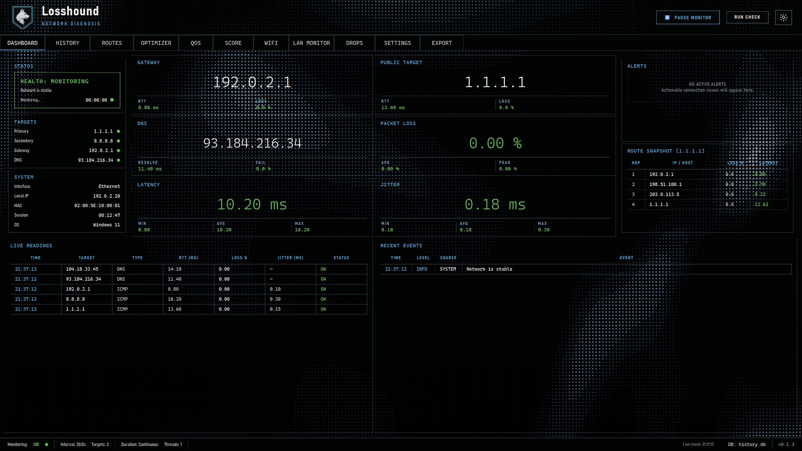

# Losshound

<p align="center">
  
</p>

Lightweight Windows network diagnosis and optimization tool that continuously monitors connectivity, determines the most likely cause of network issues, and can automatically tune your network stack for better performance.

Losshound identifies whether failures originate from your **LAN**, **router/gateway**, **ISP/WAN**, **DNS**, or **upstream routing** — and tells you in plain language.

## Features

### Network Diagnosis
- **Automatic gateway detection** — finds your default gateway automatically
- **Continuous monitoring** — ping, DNS, and route checks on configurable intervals
- **Rule-based diagnosis** — transparent fault-domain inference with adjustable thresholds
- **Tracks key metrics** — packet loss, latency, jitter, DNS resolution time, route changes
- **Dark-themed GUI** — clean, compact PySide6 interface with dashboard, history, and route views
- **CLI mode** — run from the terminal with `--cli` flag
- **Export reports** — save diagnostic reports as TXT or JSON
- **Local storage** — SQLite-based history with automatic pruning
- **No telemetry by default** — diagnostics stay local; optional webhooks send alerts only when you configure them

### LAN Monitor & Connection Tracking
- **Offline Subnet Scanning:** Discovers active devices on your local network completely offline with zero telemetry or remote API calls.
- **Multicast & Link-Local Hostname Resolution:** Resolves device names using mDNS, LLMNR, NetBIOS node status queries, and vendor OUI dictionary mappings.
- **SSDP/UPnP friendlyName Extraction:** Discovers smart home and IoT devices (like Google Nest, Chromecast, or printers) and pulls their human-readable friendly names.
- **HTTP Homepage Title Resolution:** Queries local router and hardware homepages (ports 80/443), following same-host meta-refresh redirects to extract admin page titles.
- **Manual Hostname Customization:** Allows double-clicking any device hostname in the table to set a persistent custom label.
- **Active Connection Tracker:** Maps local process IDs (PIDs) to active network sockets (TCP/UDP) using backgrounded `netstat` and `tasklist` sweeps.
- **Opt-in Firewall Helper:** With explicit confirmation and Administrator access, scopes a narrow inbound discovery rule to the packaged Losshound executable (never a shared `python.exe`).

### Network Optimizer
- **One-click optimization** — automatically tune your Windows network stack
- **DNS benchmark** — test 14 public DNS servers, auto-switch to the fastest
- **TCP/IP stack tuning** — auto-tuning level, CTCP congestion provider, ECN, RSS, timestamps
- **Nagle's algorithm** — disable for lower latency in games and real-time apps
- **Network throttling** — disable Windows multimedia network throttling
- **MTU optimization** — binary search for optimal MTU without fragmentation
- **Adapter tuning** — disable power management and interrupt moderation
- **Backup & restore** — full settings snapshot before changes, one-click revert

### Performance Benchmarking
- **Idle benchmark** — ping latency, jitter, packet loss, DNS resolution, TCP connect times
- **Load benchmark** — latency under load, bufferbloat grade (A-F), throughput, small packet responsiveness
- **Before/after comparison** — see the real impact of optimizations with detailed metrics
- **Persistent history** — benchmarks saved to disk for later comparison

## Installation

### Download (recommended)

Grab the latest **`Losshound.exe`** from the [Releases](https://github.com/NoSelection/Losshound/releases) page. It's a single portable file — no installer, no dependencies, nothing written to Program Files or the registry. Just run it.

> On first launch, Windows SmartScreen may warn about the unsigned binary — click **More info → Run anyway**. (Signing requires a paid certificate.)

### From source

```bash
# Clone the repository
git clone https://github.com/NoSelection/Losshound.git
cd Losshound

# Create a virtual environment
python -m venv venv
venv\Scripts\activate

# Install Losshound and its dependencies in editable mode
pip install -e .

# Run the application
python -m losshound
```

### `run_as_admin.bat` (source checkout only)

The batch launcher starts the source version of Losshound with Windows
Administrator privileges. It activates the repository's `venv` when present,
requests elevation through the standard UAC prompt, and then runs
`python -m losshound` from the project directory.

1. Complete the **From source** installation above first.
2. Inspect `run_as_admin.bat` before running it, as you should with any script
   that requests Administrator access.
3. Double-click the file and approve the Windows UAC prompt, or launch a
   specific command from a terminal, such as `run_as_admin.bat restore`.

Normal diagnostics do not require elevation. Use this launcher only when you
intend to apply or restore Optimizer, QoS, or firewall changes. If you downloaded
`Losshound.exe` instead, right-click that executable and choose **Run as
administrator** when one of those actions requires it; the batch file is not
needed.

### Requirements

- Python 3.10+
- Windows 10/11
- PySide6

## Usage

### GUI mode (default)

```bash
python -m losshound
```

For a useful first session:

1. Leave Dashboard monitoring for several minutes so Losshound can establish a baseline.
2. Follow the diagnosis action when a warning appears; Routes, WiFi, LAN Monitor, and Drops provide the supporting evidence.
3. Run a Score or load benchmark before changing network settings.
4. Apply only the reviewed Optimizer/QoS actions you want, then benchmark again.
5. Use Export to create an ISP-ready report when the problem is upstream.

### CLI mode

```bash
python -m losshound --cli
```

### Optimizer commands

```bash
# Check current network settings
losshound net-status

# Benchmark DNS servers
losshound dns-benchmark

# Optimize everything (run as Administrator for full optimization)
losshound optimize

# Revert all changes
losshound restore
```

### Benchmark commands

```bash
# Basic benchmark (idle network tests)
losshound benchmark --label before
losshound optimize
losshound benchmark --label after
losshound compare

# Load benchmark (latency under load, bufferbloat, throughput)
losshound load-benchmark --label before
losshound optimize
losshound load-benchmark --label after
losshound load-compare
```

### Options

```
--cli              Run in CLI mode (no GUI)
--config PATH      Path to configuration file
--log-level LEVEL  Logging level (DEBUG, INFO, WARNING, ERROR)
```

### Subcommands

| Command | Description |
|---------|-------------|
| `optimize` | Optimize network performance (best with Administrator) |
| `restore` | Revert all optimizations from backup |
| `net-status` | Show current network optimization status |
| `dns-benchmark` | Benchmark 14 public DNS servers |
| `benchmark` | Run idle network performance benchmark |
| `compare` | Compare before vs after idle benchmarks |
| `load-benchmark` | Run network load benchmark (bufferbloat, throughput) |
| `load-compare` | Compare before vs after load benchmarks |
| `score` | Run a benchmark and calculate the current network score |
| `trends` | Summarize performance trends over a selected time window |
| `history` | List recent benchmark snapshots and scores |
| `wifi` | Run Wi-Fi signal, channel, and interference diagnostics |
| `drop-analyze` | Capture and attribute a connectivity-drop episode |
| `qos`, `qos-list`, `qos-clear` | Manage per-application QoS policies |
| `isp-report` | Generate a text or PDF evidence report for ISP support |

## What the Optimizer Does

| Optimization | What it changes | Why |
|---|---|---|
| DNS servers | Switches to fastest tested DNS | Faster domain resolution |
| TCP auto-tuning | Sets to `normal` | Ensures receive window scales properly |
| Congestion provider | Sets to `ctcp` (Compound TCP) | Better throughput under packet loss |
| ECN capability | Enables | Routers signal congestion instead of dropping |
| RSS | Enables | Distributes network processing across CPU cores |
| TCP timestamps | Enables | Better RTT estimation and PAWS protection |
| Nagle's algorithm | Disables | Sends small packets immediately (lower game latency) |
| Network throttling | Disables | Removes Windows multimedia network throttle |
| MTU | Optimizes via binary search | Eliminates packet fragmentation |
| Adapter power mgmt | Disables | Prevents adapter sleep causing latency spikes |
| Interrupt moderation | Disables | Lower latency at cost of slightly more CPU |

All changes are backed up before applying. Run `losshound restore` to undo everything.

## Configuration

Configuration is stored in `%LOCALAPPDATA%\Losshound\config.json`. Default values are used if no config file exists.

You can also edit settings through the GUI's Settings tab.

### Key settings

| Setting | Default | Description |
|---------|---------|-------------|
| `ping_interval_seconds` | 30 | How often to run ping checks |
| `dns_interval_seconds` | 60 | How often to run DNS checks |
| `route_interval_seconds` | 300 | How often to run tracert |
| `public_ping_targets` | 1.1.1.1, 8.8.8.8 | IPs to ping for WAN testing |
| `dns_test_hostnames` | google.com, chatgpt.com | Domains to resolve for DNS testing |
| `history_retention_hours` | 24 | How long to keep history |
| `lan_discovery_firewall_enabled` | false | Opt in to the packaged-app LAN discovery firewall rule |

### Diagnosis thresholds

| Threshold | Default | Description |
|-----------|---------|-------------|
| `gateway_loss_threshold` | 20% | Loss % to flag gateway issues |
| `public_loss_threshold` | 20% | Loss % to flag WAN issues |
| `dns_failure_threshold` | 50% | DNS failure rate to flag DNS issues |
| `latency_warning_ms` | 150 | Latency to flag as elevated |
| `jitter_warning_ms` | 50 | Jitter to flag as elevated |
| `route_change_sensitivity` | 3 | Route changes in window to flag instability |

## Architecture

```
src/losshound/
|-- app.py                  # GUI/CLI entry point and validation
|-- core/
|   |-- config.py           # Validated, atomic configuration management
|   |-- diagnosis.py        # Rule-based fault-domain diagnosis
|   |-- scheduler.py        # Concurrent, deadline-aware monitor worker
|   |-- windows_network.py  # Locale-independent active-route interface state
|   |-- ping.py             # Native ICMP + subprocess fallback
|   |-- route_monitor.py    # Tracert parsing and route comparison
|   |-- drop_analyzer.py    # Disconnect capture and attribution
|   |-- lag_attribution.py  # Local-process vs upstream lag attribution
|   |-- dns_checks.py       # DNS resolution checks
|   |-- dns_bench.py        # Raw UDP resolver benchmark
|   |-- benchmark.py        # Idle network benchmark
|   |-- load_benchmark.py   # Loaded latency, throughput, and bufferbloat
|   |-- optimizer.py        # Verified optimization, backup, and rollback
|   |-- qos.py              # Per-application Windows QoS policies
|   |-- lan_monitor.py      # LAN scan and local name discovery
|   |-- wifi_diag.py        # Wi-Fi signal/channel diagnostics
|   `-- isp_report_pdf.py   # ISP evidence report rendering
|-- storage/
|   `-- history.py          # SQLite persistence
|-- gui/
|   |-- main_window.py      # Application lifecycle and navigation
|   |-- dashboard.py        # Live overview and diagnosis actions
|   |-- history_tab.py      # Diagnosis history
|   |-- route_tab.py        # Current route and changes
|   |-- optimizer_tab.py    # Optimizer and benchmark workflow
|   |-- qos_tab.py          # Saved and applied QoS policies
|   |-- score_tab.py        # Score and trends
|   |-- wifi_tab.py         # Wi-Fi and bufferbloat workflow
|   |-- lan_tab.py          # LAN devices and connections
|   |-- drop_tab.py         # Drop capture and forensics
|   |-- settings_tab.py     # Monitoring, alert, and behavior settings
|   `-- export_tab.py       # Quick, ISP, JSON, TXT, and PDF reports
`-- cli/
    |-- runner.py           # Continuous CLI monitor
    `-- optimizer_cli.py    # Optimizer/benchmark/report commands
```

### Data flow

1. **Scheduler** (background thread) runs tests on timers
2. **Gateway**, **Ping**, **DNS**, and **Route** modules collect observations
3. **Diagnosis engine** analyzes recent observations with rule-based logic
4. Results are stored in **SQLite** and emitted to the **GUI** via Qt signals

### Diagnosis logic

The engine uses a priority-ordered rule cascade:

1. Gateway unreachable → **LAN issue**
2. Gateway OK, public IPs unreachable → **ISP/WAN issue**
3. Gateway OK, public IPs OK, DNS failing → **DNS issue**
4. Route path unstable → **Upstream route issue**
5. Sporadic loss bursts → **Intermittent instability**
6. Everything OK → **Healthy**

## Building

### Development

```bash
pip install -e ".[dev]"
pytest
```

### Packaging with PyInstaller

A ready-to-use spec is included that produces a single, portable `Losshound.exe`:

```bash
pip install pyinstaller
pyinstaller Losshound.spec
```

The built executable will be at `dist/Losshound.exe` — copy it anywhere and run; no installation required.

## Data storage

All data is stored locally:

- **History database**: `%LOCALAPPDATA%\Losshound\history.db`
- **Configuration**: `%LOCALAPPDATA%\Losshound\config.json`
- **Logs**: `%LOCALAPPDATA%\Losshound\losshound.log`
- **Optimizer backup**: `%LOCALAPPDATA%\Losshound\optimizer_backup.json`
- **Benchmark history**: `%LOCALAPPDATA%\Losshound\benchmark_history.json`

## Uninstall

Losshound is portable — nothing is installed in Program Files, the registry, or the Start Menu. To remove it completely:

1. **If you used the Optimizer**, first revert any network changes — open the Optimizer tab and click **Restore**, or run `losshound restore`.
2. **Delete the executable** (`Losshound.exe`) from wherever you put it.
3. **Delete the data folder** — `%LOCALAPPDATA%\Losshound\` (history database, settings, logs). Paste that path into File Explorer's address bar to open it.

That's everything — no leftovers.

## Known limitations

- Windows only (uses Windows-specific tools: ping, tracert, ipconfig, netstat, tasklist)
- Default-route interface, gateway, LAN subnet, DNS, and optimizer selection use locale-independent Windows objects; detailed Wi-Fi text parsing may still vary by Windows language
- Tracert checks are slow (30-90 seconds) and run on a longer interval
- VPN connections may confuse gateway detection
- No IPv6 support currently
- Some optimizer and firewall features require Administrator privileges

## Contributing

Contributions are welcome! Please:

1. Fork the repository
2. Create a feature branch
3. Write tests for new functionality
4. Submit a pull request

## License

MIT License. See [LICENSE](LICENSE) for details.
